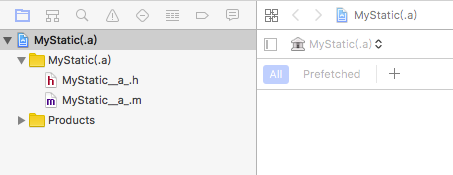
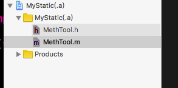
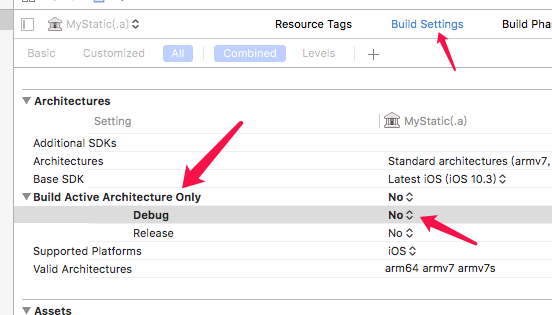
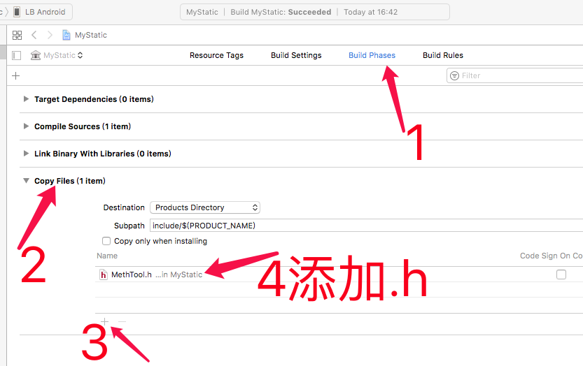
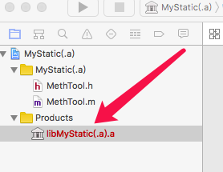
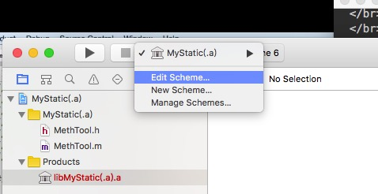

# **.a** 静态库的制作(Debug模式)

### 创建工程(**iOS项目中** 选择	 **Framework & Library**)

 
 
 
### 系统会自动为你新建的项目创建2个文件,可以直接删除

 
 
 
### 新建自己的类

 
 
 
### 然后编写好代码

 
 
 

### 更改系统的配置

 
 
 

 
 
 
### CMD + B编译(要编译2次 模拟器和真机)

* 模拟器随便选择(小弟我这里选的是6)
	
	
* 真机可以不选择

	

 
 
 

### 右击 show in finder(不要右击错了)

 
 
 
### 到finder 中
	
**PS:可以看到有2个文件夹, 其中一个就是模拟器的,一个就是真机的**
	
 
 
 

### 打开终端(cd到这2个文件下,用命令查看这2个.a 支持什么架构)

* 模拟器(可以看到模拟器支持 i386 和 x86_64)
	
	
* 真机(可以看到真机支持 arvm7 和 arvm64)
	 
 
 
 
### 合并这2个.a

 
 
 
### 再次检查看看(可以看到都支持了)

 
 
 
### 新建文件夹(将头文件()和新生成的 .a 拖进新的文件夹中)

 
 
 

### 别的项目中就可要直接拖入 Lib 文件然后导入头文件就可以用了
 
 
 
 
 
 

#### PS: 上面的几步系统配置是有原因的(架构不对就不能跑在不一样架构的机子上)

* 模拟器支持的架构
	
	* 模拟器
		- 4s~5 		i386
     	- 4s~5 		i386
     	- 5s~7 		x86_64
     
     
    * 真机
     	- 5/5c       	arm7s
     	- 3gs~4s   	armv7
     	- 5s ~ 7     	arm64
    
    * armv7 是兼容 armv7s的,所以合并后的文件支持很多架构,可以跑在真机和模拟器上

 
 
# release版本和debug没什么区别只需要在完成调试代码之后更改一下操作,然后 编译 就和debug的操作一样了

# 开发中如果想调试静态库的话, 直接新建target(和上面新建工程是一样的),然后调试完后,打包这个 target, 和前面的一样,不过在别的 target 中记得要导入这个库,不要会找不到,而且不用更改架构
 

 

